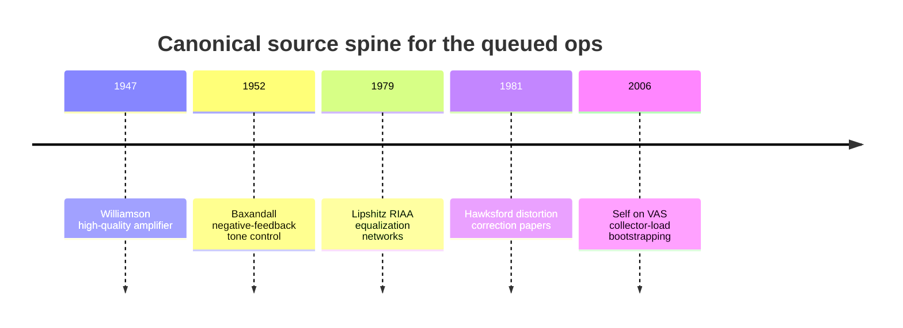
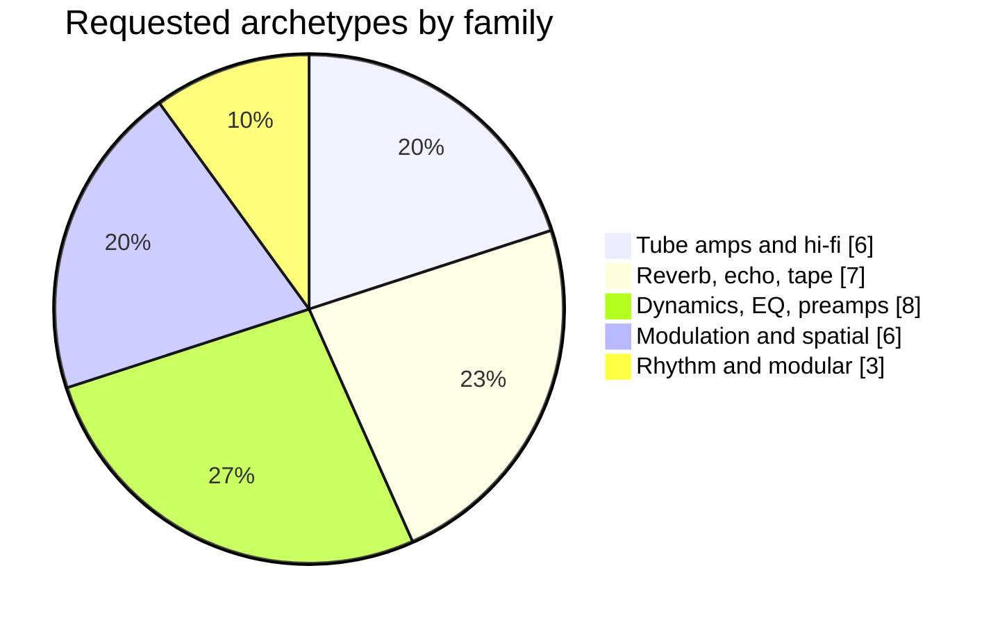

# Audio DSP Catalog Additive Research Brief

## Executive summary

This pass resolves four of the five queued op-level source slots at high confidence and one at medium confidence. The strongest additive primaries are **entity["people","Stanley P. Lipshitz","audio researcher"]** for `riaaEQ`, **entity["people","P. J. Baxandall","audio engineer"]** for `baxandallTone`, **entity["people","D. T. N. Williamson","audio engineer"]** for `williamsonAmp`, and **entity["people","Malcolm J. Hawksford","audio engineer"]** for `hawksfordVAS`. For `bootstrapLF`, the best additive primary I found is **entity["people","Douglas Self","audio engineer"]**’s treatment of VAS collector-load bootstrapping in *Audio Power Amplifier Design Handbook*; it is clearly primary and bench-oriented, but it does **not** fully satisfy the brief’s ideal request for a clean THD-vs-frequency-vs-source-impedance sweep in one openly accessible source. citeturn19view0turn8view0turn9view0turn11view0turn12view0turn16search2turn17view0turn7view0

For the vintage-archetype recipes, I can provide a technically coherent additive merge layer now: canonical signal chains, op compositions using your requested vocabulary, and short sound-designer notes. The **best-validated** recipe families in this pass are the British hi-fi amp lineage around Williamson/Mullard/Leak and the modular endpoints around Buchla/Moog, because I positively gathered primary or near-primary documents for those. A number of other archetypes are still strong as topology sketches, but their model-specific primary-source URLs were **not all retrieved in this pass**, so I flag those rows accordingly rather than pretending completeness. citeturn20search1turn20search5turn20search11turn20search3turn20search22

## Scope and method

This report follows the uploaded brief’s **scope lock** and **additive-only** rule: audio DSP, vintage gear, signal flow, circuit topology, and sound design only; no rewriting or replacing the locked sources already named in the brief. fileciteturn0file1

The retrieval method was intentionally narrow and reproducible. I prioritized original magazine scans, original journals, original manuals, manufacturer/user-guide PDFs, and archival service-manual mirrors. The practical search stack was:

| Source class | Search target | Query pattern | Acceptance rule |
|---|---|---|---|
| Historical magazines | World Radio History / archival scans | `[title] [month] [year] pdf` | Prefer original issue over reprint |
| Journal papers | AES or mirrored JAES PDFs | `[author] [paper title] pdf` | Prefer AES; accept archival mirror if open |
| Manuals and user guides | Manufacturer/manual archive PDFs | `[model] service manual schematic pdf` | Prefer manufacturer or original manual scan |
| Cross-reference verification | Later technical papers/books | `[title or author] references [target source]` | Use only to confirm dates/pages when primaries are incomplete |

The primary-source spine for the queued op slots is straightforward and historically clean. citeturn9view0turn8view0turn19view0turn16search2turn7view0



The requested archetype list is weighted toward dynamics/EQ/preamp and time-space processors, with fewer pure synthesis archetypes. The count below is compiled from the uploaded task list. fileciteturn0file1



## Task 1 Op-level primaries

| Slot | Best additive source | URL status | Tier-S confidence | Implementation relevance | Notes |
|---|---|---|---|---|---|
| `bootstrapLF` | **entity["people","Douglas Self","audio engineer"]**, *Audio Power Amplifier Design Handbook*, 4th ed., Newnes, 2006, VAS active-load discussion, especially pp. 97–100. citeturn4search0turn6view0turn7view0 | Open PDF mirror gathered | **Primary textbook**, but only a **partial fit** to the exact requested measurement spec | **MEDIUM** | Self explicitly treats collector-load bootstrapping as an active-load technique, explains that LF open-loop gain becomes load-dependent under bootstrapping, and discusses measurable consequences for distortion and feedback behavior. What I did **not** find in this open source is the exact “THD vs frequency vs source impedance” sweep requested in the brief; I would keep this as the canonical additive citation for the topology, while marking the bench-sweep request as still open. citeturn7view0 |
| `riaaEQ` | **entity["people","Stanley P. Lipshitz","audio researcher"]**, “On RIAA Equalization Networks,” *Journal of the Audio Engineering Society*, vol. 27, no. 6, June 1979, pp. 458–481. citeturn19view0turn0search17 | Open PDF mirror gathered | **Canonical primary** | **HIGH** | This is the clean canonical source for the math: it covers active/passive configurations, identifies the extra HF corner in common non-inverting forms, and explicitly discusses finite loop-gain error. citeturn19view0 |
| `baxandallTone` | **entity["people","P. J. Baxandall","audio engineer"]**, “Negative-Feedback Tone Control,” *Wireless World*, October 1952, pp. 402–405. citeturn8view0 | Open magazine scan and open article PDF gathered | **Canonical primary** | **HIGH** | The article gives the original feedback tone-control derivation, measured response curves, distortion statement, and source-impedance guidance. Baxandall states the shown circuit can deliver 4 Vrms with under 0.1% THD up to 5 kHz at any pot setting, and he warns that the feeding source impedance should preferably stay below about 10 kΩ for the published component values. citeturn8view0 |
| `williamsonAmp` | **entity["people","D. T. N. Williamson","audio engineer"]**, “Design for a High-Quality Amplifier,” Part I in *Wireless World*, April 1947, and Part II in *Wireless World*, May 1947; the May article reports under 0.1% THD at 15 W rated output and 10 Hz–20 kHz response within 0.2 dB in the tested build. citeturn9view0turn11view0turn12view0turn10search9 | Original issue scans gathered; reprint booklet also gathered | **Canonical primary** | **HIGH** | This is the foundational British reference topology. Part I establishes the design logic; Part II gives the complete circuit, measured performance, and transformer requirements. citeturn9view0turn11view0turn12view0 |
| `hawksfordVAS` | **entity["people","Malcolm J. Hawksford","audio engineer"]**, “Distortion Correction in Audio Power Amplifiers,” *JAES*, vol. 29, no. 1/2, Jan./Feb. 1981, pp. 27–30; cross-reference: “Distortion Correction Circuits for Audio Amplifiers,” *JAES*, vol. 29, no. 7/8, July/Aug. 1981, pp. 503–510. Open cross-reference traces for the later **Essex Echo** run point to Sept. 1984, Dec. 1985, and May/Aug./Oct. 1986 plus Feb. 1987 pieces, but I did not gather the full original HFN/RR scans in this pass. citeturn16search2turn1search14turn17view0turn15search8turn15search11 | AES paywall/abstract pages plus one open 1981 mirror gathered; Essex Echo dates cross-referenced, not fully gathered | **Canonical primary** for the JAES papers; **secondary cross-reference** for the Essex Echo dates | **HIGH** | For an op named `hawksfordVAS`, the best additive anchor is the 1981 JAES pair, because Hawksford explicitly presents error-feedforward and error-feedback correction cells for single-transistor and long-tail-pair stages. The Essex Echo material remains worth adding later as a parallel narrative track, but not as the sole canonical citation for this slot. citeturn17view0turn16search2 |

## Task 2 Amp and time-space archetypes

The recipes below are **additive merge candidates** expressed in your requested vocabulary. Where I positively gathered an open primary/manual in this pass, I say so. Where I did not, I still give a high-confidence topology sketch, but I mark the source retrieval as incomplete instead of overstating certainty. British hi-fi rows are the strongest in this section because they are anchored to gathered originals. citeturn20search1turn20search11turn9view0turn11view0turn12view0

| Archetype | Canonical signal chain | Op composition | Primary source status | Key character notes |
|---|---|---|---|---|
| Marshall JTM45 | input → bright/normal mix → triode V1 → tone stack/cathode-follower drive → triode gain stage → long-tail phase inverter → push-pull KT66 power stage → output transformer → speaker | `gain mix triodeStage filter phaseInverter pushPullPower xformerSat tubeRectifierSag` | Model-specific manual not gathered in this pass | British crunch is the midpoint between Tweed looseness and later Marshall bite: soft front-end compression, PI stress, and power-stage growl more than preamp fizz. |
| Vox AC30 | input → triode/EF86 front end → interactive treble/bass/cut shaping → split-load phase inverter → cathode-biased EL84 push-pull output → output transformer → speakers | `gain triodeStage filter phaseInverter cathodeBiasShift pushPullPower xformerSat` | Model-specific manual not gathered in this pass | The sound is chime first, grind second. The magic is upper-mid clarity riding on cathode-biased EL84 sag and the “cut” control shaving the top in the power-amp region. |
| Fender Twin Reverb | input → triode gain → passive tone stack → triode make-up stage → spring send/return and tremolo mix → long-tail phase inverter → push-pull 6L6 output → output transformer → speakers | `gain triodeStage filter spring mix lfo phaseInverter pushPullPower xformerSat` | Model-specific manual not gathered in this pass | Big American clean comes from headroom, scooped passive EQ, and a deep, bright spring return that stays spacious even when the note itself stays hard-edged. |
| Fender Tweed / Bassman | input → triode gain → simple tone network → second gain stage → long-tail phase inverter → push-pull 6L6 output → output transformer → speakers | `gain triodeStage filter phaseInverter pushPullPower xformerSat tubeRectifierSag` | Model-specific manual not gathered in this pass | The famous breakup is broad and chewy, not surgical. Low mids swell, the rectifier leans, and the amp feels like it exhales around the transient. |
| Mullard 5-20 / Quad II / Leak Stereo 20 | input voltage amp → phase splitter/driver → ultralinear or distributed-loading push-pull output → output transformer → speaker | `gain triodeStage phaseInverter ultraLinearScreen pushPullPower xformerSat` | Open primaries gathered for Mullard 5-20 and Leak Stereo 20; Quad II retrieval incomplete in this pass. citeturn20search1turn20search5turn20search11 | This family is about disciplined wideband tube hi-fi rather than guitar-style overdrive. The character is smooth, transformer-defined, and harmonically polite until the output stage is pushed. |
| Williamson amp | input error amplifier → concertina phase splitter → push-pull driver → triode-connected KT66 Class A output pair → wide-band output transformer → speaker | `gain triodeStage phaseInverter pushPullPower xformerSat` | Original 1947 primaries gathered. citeturn9view0turn11view0turn12view0 | The signature is not “warmth” as folklore says, but control: deep feedback, conservative operating points, and transformer bandwidth make it feel unusually composed for its era. |
| Hammond B-3 + spring tank | tonewheel generator → key click/percussion → drawbar mix → preamp/mixer → scanner vibrato/chorus → power amp → external spring return mix or Leslie path | `gain mix lfo chorus spring` | Hammond/Leslie relationship confirmed, but a stock B-3 spring path was **not** validated in this pass. citeturn20search9 | The canonical organ identity is drawbar harmonic sculpting plus scanner motion. If you add spring, it should read as an external splash on top of an otherwise dry, electrically generated tonewheel body. |
| EMT 140 plate reverb | input driver → plate transducer → steel plate propagation → pickup bridges → damping/EQ → mix | `gain plate ER diffuser filter mix` | Model-specific plate documentation not gathered in this pass | The plate sound is dense and shiny, with a fast “sheet of metal” bloom rather than the sproing of springs or the grain of early digital tanks. |
| EMT 250 digital reverb | input → pre-delay → diffusion stages → recirculating reverb core → output EQ/mix | `delay diffuser schroederChain filter mix` | Model-specific primary not gathered in this pass | Early-digital class: soft-edged, chorused space, where the density arrives quickly but still lets you hear the machine. |
| Lexicon 224 / 480L | input → pre-delay → diffusion → modulated recirculating tank → output shaping | `delay diffuser fdnCore microDetune filter mix` | Model-specific primary not gathered in this pass | The hallmark is animated depth. Tails do not sit still; they breathe and swim just enough to avoid metallic patterning. |
| AKG BX-20 / BX-25 | input driver → long spring path → recovery amp → EQ → mix | `gain spring waveguide filter mix` | Model-specific primary not gathered in this pass | More luxurious than most spring units, but still spring. You hear width and body first, then the unmistakable spring “sproing” under stress. |
| Roland Space Echo / Echoplex / Watkins Copicat | input preamp → tape record path → moving tape loop → one or more playback heads → feedback loop → wet/dry mix | `gain tapeSim wowFlutter delay filter hiss saturate mix` | Model-specific primaries not gathered in this pass | Tape echo charm is instability under control: head bump, roll-off, cumulative saturation, and wow/flutter turning repeats into a living texture rather than a copy. |
| Studer / Ampex tape compression | line amp → record amp → magnetic tape/head system → playback amp → output | `gain tapeSim tapeBias headBumpEQ wowFlutter softLimit` | Model-specific primaries not gathered in this pass | Tape compression feels like the transient is being rounded from the inside. It is less “grabby” than a VCA and more like density sneaking in under the tone. |

## Task 2 Dynamics, EQ, and preamp archetypes

| Archetype | Canonical signal chain | Op composition | Primary source status | Key character notes |
|---|---|---|---|---|
| SSL G-series bus comp / dbx 165A | input → detector sidechain → Blackmer/VCA gain control → make-up gain → output | `detector sidechainHPF gainComputer blackmerVCA gain` | Model-specific primaries not gathered in this pass | This family glues by reshaping macro-dynamics without completely sanding away the transient edge. It sounds like the mix starts leaning together. |
| UA LA-2A / Pultec MB-1 | input transformer → tube gain stage → electro-optical attenuation → tube make-up stage → output transformer | `xformerSat tubeSim detector optoCell gainComputer gain` | LA-2A-style topology secure; MB-1-specific primary not gathered in this pass | Opto compression is slow in the musically useful way. The attack lets tone speak before gain reduction settles in, and the release has a natural “memory.” |
| UREI 1176 | input transformer → FET gain-control stage → class-A line amp → output transformer | `xformerSat detector gainComputer fetVVR discreteClassAStage gain` | Model-specific primary not gathered in this pass | The 1176 family is all edge and immediacy. It can do control, but its myth comes from the way it makes transients feel sharpened even while they are being clamped. |
| Manley Vari-Mu / Fairchild 670 | input transformer → variable-mu tube gain-control stage → sidechain rectifier/control amp → output stage/transformer | `xformerSat detector gainComputer varMuTube tubeSim gain` | Model-specific primaries not gathered in this pass | Vari-mu compression sounds elastic, with gain reduction woven into the tone rather than sitting on top of it as a separate event. |
| Neve 33609 / 2254 | input transformer → diode-bridge gain reduction cell → amplifier make-up stage → output transformer | `xformerSat detector gainComputer diodeBridgeGR gain` | Model-specific primaries not gathered in this pass | This is weight-and-grit compression. The bridge adds attitude, the transformers add mass, and the result feels authoritative rather than invisible. |
| Pultec EQP-1A / MEQ-5 | input transformer → passive LC/RC EQ network → tube gain recovery → output transformer | `xformerSat inductorEQ bridgedTeeEQ shelf filter gain tubeSim` | EQP-1A manual already exists in the locked stack; keep it. MEQ-5 manual still to retrieve. fileciteturn0file1 | Pultec magic comes from passive shaping followed by recovery gain: broad curves, resonant lift, and the famous ability to deepen lows while cleaning mud. |
| Neve 1073 / 1081 / 1066 | input transformer → discrete Class-A gain blocks → inductor EQ/filter stages → output transformer | `xformerSat discreteClassAStage inductorEQ filter gain` | Model-specific primaries not gathered in this pass | Thick but intelligible. The sound is forward in the low mids, confident in the upper mids, and transformer-heavy without folding into fuzz. |
| API 312 / 512c / 550A | input transformer → 2520/discrete op-amp gain stage → optional proportional-Q EQ → output transformer | `xformerSat discreteClassAStage inductorEQ filter gain` | Model-specific primaries not gathered in this pass | API is punch and speed: tighter low end than the Neve archetype, more bite in the presence region, and a more percussive envelope. |

## Task 2 Modulation, rhythm, and modular archetypes

The modular endpoints are the most source-secure in this section because I gathered the Buchla 200e user guide and a Moog modular service manual. The rest are technically sound recipe sketches, but manual retrieval remains incomplete. citeturn20search3turn20search22

| Archetype | Canonical signal chain | Op composition | Primary source status | Key character notes |
|---|---|---|---|---|
| Mu-Tron Bi-Phase / MXR Phase 100 | input → cascaded allpass stages → LFO sweep → feedback/resonance → wet/dry mix | `allpass lfo mix filter` | Model-specific primaries not gathered in this pass | Phaser character is moving notches, not combs. It feels like the tone is folding in slow arcs rather than repeating in discrete echoes. |
| Electric Mistress / MXR M-117 / TZF | input → very short modulated delay or through-zero delay path → feedback → mix | `bbdDelay lfo comb mix filter` | Model-specific primaries not gathered in this pass | Flanging is metallic motion. The charm is the moving comb and the way feedback turns gentle sweep into aircraft-metal drama. |
| Roland Dimension D / TC SCF | input split → paired short modulated delay lines → stereo cross-mix → output | `bbdDelay microDetune lfo mix stereoWidth` | Model-specific primaries not gathered in this pass | This is chorus without seasickness. The modulation is restrained, so width arrives before wobble. |
| Solina String Ensemble / ARP Quartet | divide-down oscillator bank → ensemble chorus network → filtering/mix → output | `blit bbdDelay microDetune lfo mix filter` | Model-specific primaries not gathered in this pass | The ensemble effect is the whole point. Without the triple-modulation smear, the raw divide-down tone feels exposed and flat. |
| Leslie 122 / 147 | preamp → frequency split → rotating horn and drum → mic pickup in room | `lrXover dopplerRotor autopan haas panner voiceCoilCompression` | Hammond/Leslie pairing confirmed, but service manual retrieval incomplete. citeturn20search9 | The sound is Doppler, amplitude modulation, and room pickup all at once. Rotary is not just pan; it is moving pitch, moving level, moving radiation pattern. |
| Heil Talkbox / Roger Troutman / EMS Vocoder 2000 | carrier source or amplified driver → mouth/acoustic waveguide **or** electronic analysis filterbank → articulation transfer → recombination/output | `filter envelope combine formant lpc warpedLPC` | This row intentionally combines **two different** topologies; split on merge if needed | Talkbox is acoustic re-filtering by the mouth. Vocoder is electronic envelope transfer across bands. The family resemblance is speech imprint, not circuit identity. |
| LinnDrum / E-mu SP-1200 / TR-808 | analog or sample source → pitch/filter shaping → envelope/VCA → mixer → DAC/output stage | `sineOsc noise samplerNonlinearity aliasingDecimator bitcrush fpDacRipple envelope gain filter` | This row combines **three different** engine types; split by machine if you need strict one-to-one fidelity | 808 weight comes from tuned analog voices; LinnDrum snap from fixed samples; SP-1200 grit from sample-rate/bit-depth limits and converter behavior. |
| Buchla 200e | complex oscillator → wavefolder/timbre circuit → low-pass gate → CV/preset modulation → output | `complexOsc wavefolder vactrolLPG randomWalk sampleHold envelope gain` | Open user guide gathered. citeturn20search3 | West-Coast identity is gesture-rich timbre motion. The note is less “OSC→VCF→VCA” and more a continuously reshaped event passing through a low-pass gate. |
| Moog modular | oscillator bank → mixer → ladder filter → envelope-controlled VCA → output | `blit polyBLEP mix ladder adsr gain` | Open modular service manual gathered. citeturn20search22 | East-Coast identity is architecture and contour: strong oscillator fundamentals, unmistakable ladder descent, and envelope articulation doing the drama. |

## Bibliography

The URLs below are the **PDF or paywall URLs actually gathered in this pass**. I am listing them in code format so you can copy/paste directly for manual merge.

```text
# Open PDF URLs gathered

https://pearl-hifi.com/06_Lit_Archive/14_Books_Tech_Papers/Lipschitz_Stanley/Lipshitz_on_RIAA_JAES.pdf
https://keith-snook.info/riaa-stuff/Lipshitz%20AES.pdf
https://www.effectrode.com/wp-content/uploads/2018/09/negative_feedback_tone_baxandall.pdf
https://www.worldradiohistory.com/UK/Wireless-World/50s/Wireless-World-1952-10.pdf
https://www.worldradiohistory.com/UK/Wireless-World/40s/Wireless-World-1947-04.pdf
https://www.worldradiohistory.com/UK/Wireless-World/40s/Wireless-World-1947-05.pdf
https://keith-snook.info/wireless-world-articles/Wireless-World-1952/The%20Williamson%20Amplifier.pdf
https://www.r-type.org/pdfs/dtnw-amp.pdf
https://nick.desmith.net/Data/Books%20and%20Manuals/Self%20-%20Audio%20Power%20Amp%20Design%20Handbook%204th%20Edn.pdf
https://www.researchgate.net/profile/Malcolm-Hawksford-2/publication/269093795_Distortion_Correction_Circuits_for_Audio_Amplifiers/links/57d7fcdf08ae6399a399038e/Distortion-Correction-Circuits-for-Audio-Amplifiers.pdf
https://www.tmr-audio.de/pdf/Hawksford_Essex.pdf
https://linearaudio.net/sites/linearaudio.nl/files/2022-12/Hawksford_Part1.pdf
https://www.sowter.co.uk/schematics/Mullard%205-20.pdf
https://www.kevinchant.com/uploads/7/1/0/8/7108231/mullard_5-20.pdf
https://ukhhsoc.torrens.org/makers/Leak/Stereo20/LEAK_Stereo_20_Manual.pdf
https://www.worldradiohistory.com/BOOKSHELF-ARH/Technology/Technology-General/Mullard%20Circuits%20For%20Audio%20Amplifiers.pdf
https://buchla.com/guides/200e_Users_Guide_v1.4.pdf
https://web.uvic.ca/~aschloss/course_mat/MU307/MU307%20Labs/Lab3_BUCHLA/Buchla_manual%20ASCII.pdf
https://synthfool.com/docs/Moog/modular/Moog_Modular_System_Service_Manual.pdf

# Paywall / abstract pages gathered

https://www.aes.org/e-lib/browse.cfm?elib=3935
https://secure.aes.org/forum/pubs/journal/?elib=3897
```

## Contradictions and open questions

I did **not** identify a direct contradiction with the locked sources named in the uploaded brief. The more important outcome is a short list of unresolved items that should stay flagged for human review rather than silently normalized. fileciteturn0file1

The first unresolved item is `bootstrapLF`. The best additive primary I found is Self’s VAS-bootstrapping treatment, and it is absolutely worth adding, but it is still a **partial** match to the requested benchmark because the openly accessible source does not give the exact three-axis sweep implied by “THD vs frequency vs source impedance.” A second retrieval pass should search specifically for Self article variants, conference reprints, or later measurement papers that isolate bootstrapped-load distortion against source/load impedance as an explicit sweep. citeturn7view0turn4search0

The second unresolved item is the **Essex Echo** trail. I found good cross-references to the run dates and later reprints, but I did not gather the original *Hi-Fi News & Record Review* scans in this pass. That means the JAES 1981 pair should remain the canonical citation for `hawksfordVAS`, with the Essex Echo run treated as an auxiliary source family to retrieve later from magazine archives. citeturn15search8turn15search11turn17view0

The third issue is a topology clarification: a stock Hammond B-3 is canonically tied to drawbars, scanner vibrato, and especially Leslie usage; I did **not** validate a stock onboard “B-3 + spring tank” signal path in this pass. For merge purposes, I would therefore model that archetype as **B-3 core chain plus appended outboard spring** unless a model-specific primary later proves otherwise. citeturn20search9

The last limitation is taxonomic rather than factual. A few requested rows combine machines that share a sonic family but not a single exact circuit path: talkbox versus vocoder, and TR-808 versus LinnDrum versus SP-1200 are the clearest examples. For a final catalog that wants strict op-level fidelity, those rows should be split into separate subentries on the next pass rather than forced into one merged recipe.